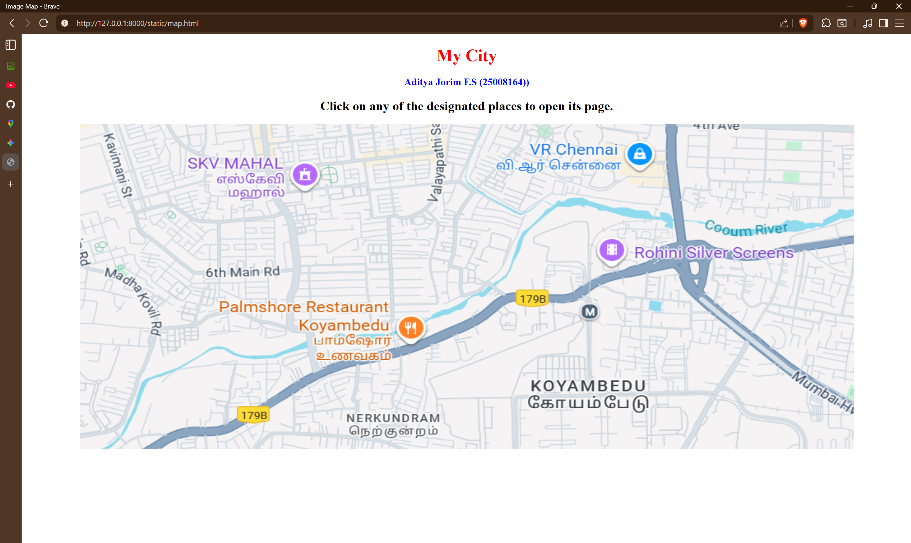
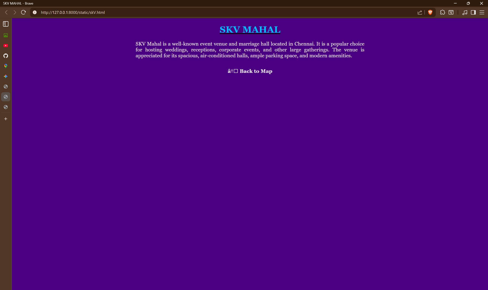
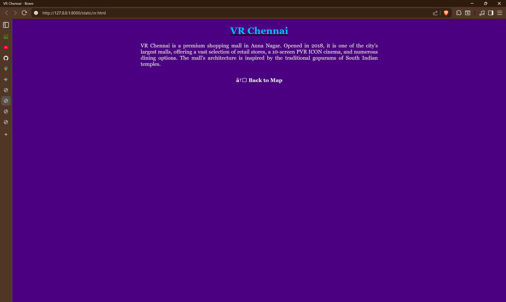

# Ex04 Places Around Me
## Date: 

## AIM
To develop a website to display details about the places around my house.

## DESIGN STEPS

### STEP 1
Create a Django admin interface.

### STEP 2
Download your city map from Google.

### STEP 3
Using ```<map>``` tag name the map.

### STEP 4
Create clickable regions in the image using ```<area>``` tag.

### STEP 5
Write HTML programs for all the regions identified.

### STEP 6
Execute the programs and publish them.

## CODE
~~~
map.html

<!DOCTYPE html>
<html>
<head>
    <title>Image Map</title>
    <style>
        body {
            text-align: center; 
        }
        
        h1 {
            color: red; 
        }
        
        h3 {
            color: blue;
        }
    </style>
</head>
<body>

    <h1><b>My City</b></h1>
    <h3><b>Aditya Jorim F.S (25008164))</b></h3>

    <h2>Click on any of the designated places to open its page.</h2>

    

    <map name="image-map">
        <area target="_blank" alt="SKV MAHAL" title="SKV MAHAL" href="skV.html" coords="55,-1,379,146" shape="rect">
        <area target="_blank" alt="VR Chennai" title="VR Chennai" href="vr.html" coords="757,118,454,3" shape="rect">
        <area target="_blank" alt="Plamshore Restaurant" title="Plamshore Restaurant" href="palm.html" coords="89,214,487,356" shape="rect">
        <area target="_blank" alt="Rohini silver" title="Rohini silver" href="rohini.html" coords="573,138,907,255" shape="rect">
    </map>

</body>
</html>

skV.html

<!DOCTYPE html>
<html>
<head>
    <title>SKV MAHAL</title>
</head>
<body bgcolor="#4B0082">

    <center>
        <h1>
            <u><font color="#00BFFF" face="Georgia, serif">SKV MAHAL</font></u>
        </h1>

        <p align="justify" style="max-width: 800px;">
            <font color="#f0f0f0" face="Georgia, serif" size="4">
                SKV Mahal is a well-known event venue and marriage hall located in Chennai. It is a popular choice for hosting weddings, receptions, corporate events, and other large gatherings. The venue is appreciated for its spacious, air-conditioned halls, ample parking space, and modern amenities.
            </font>
        </p>

        <br>

        <a href="index.html" style="text-decoration:none;">
            <font color="#f0f0f0" face="Georgia, serif" size="4"><b>← Back to Map</b></font>
        </a>
    </center>

</body>
</html>

vr.html

<!DOCTYPE html>
<html>
<head>
    <title>VR Chennai</title>
</head>
<body bgcolor="#4B0082">

    <center>
        <h1>
            <u><font color="#00BFFF" face="Georgia, serif">VR Chennai</font></u>
        </h1>

        <p align="justify" style="max-width: 800px;">
            <font color="#f0f0f0" face="Georgia, serif" size="4">
                VR Chennai is a premium shopping mall in Anna Nagar. Opened in 2018, it is one of the city's largest malls, offering a vast selection of retail stores, a 10-screen PVR ICON cinema, and numerous dining options. The mall's architecture is inspired by the traditional gopurams of South Indian temples.
            </font>
        </p>

        <br>

        <a href="index.html" style="text-decoration:none;">
            <font color="#f0f0f0" face="Georgia, serif" size="4"><b>← Back to Map</b></font>
        </a>
    </center>

</body>
</html>

palm.html

<!DOCTYPE html>
<html>
<head>
    <title>Palmshore Restaurant</title>
</head>
<body bgcolor="#4B0082">

    <center>
        <h1>
            <u><font color="#00BFFF" face="Georgia, serif">Palmshore Restaurant</font></u>
        </h1>

        <p align="justify" style="max-width: 800px;">
            <font color="#f0f0f0" face="Georgia, serif" size="4">
                Palmshore is a highly-rated restaurant chain in Chennai, celebrated for its authentic Arabian, Indian, and Chinese cuisine. It's particularly famous for its delicious barbecue dishes, Mandi biryani, and extensive seafood options, offering a memorable dining experience for families and food lovers.
            </font>
        </p>
        
        <br>

        <a href="index.html" style="text-decoration:none;">
            <font color="#f0f0f0" face="Georgia, serif" size="4"><b>← Back to Map</b></font>
        </a>
    </center>

</body>
</html>

rohini.html

<!DOCTYPE html>
<html>
<head>
    <title>Rohini Silver Screens</title>
</head>
<body bgcolor="#4B0082">

    <center>
        <h1>
            <u><font color="#00BFFF" face="Georgia, serif">Rohini Silver Screens</font></u>
        </h1>

        <p align="justify" style="max-width: 800px;">
            <font color="#f0f0f0" face="Georgia, serif" size="4">
                Rohini Silver Screens, located in Koyambedu, is an iconic cinema complex in Chennai. It is famous for its vibrant atmosphere, especially during the release of major blockbuster films. The complex features multiple screens with advanced technology, offering an unparalleled movie-watching experience.
            </font>
        </p>
        
        <br>

        <a href="index.html" style="text-decoration:none;">
            <font color="#f0f0f0" face="Georgia, serif" size="4"><b>← Back to Map</b></font>
        </a>
    </center>

</body>
</html>
~~~
## OUTPUT






## RESULT
The program for implementing image maps using HTML is executed successfully.
